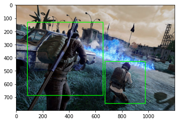
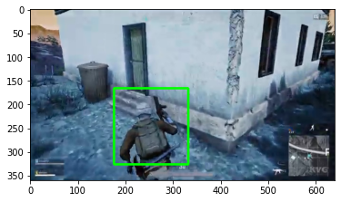
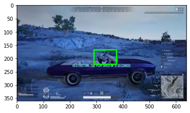

# PUBG_AIMBOT
<b>Pubg Real Time Player Detection Using TF2 </b>

 <b>Steps for training the model on google colab </b> 
 <b> follow the below link and perfrom step by step execution </b> 
"https://colab.research.google.com/drive/1tO3nGFzFX5nvARWqdr7m5bMUVM9W5NaW#scrollTo=vMNPnML5y9b7"  
(mail: ayushmishra4087@gmail.com to get the access for the colab link)

 <b>Steps for training the model on local machine </b> 
1) Create seperate virtual environment for TF2 packages installation "conda create -n (name_of_ur_choice) pip python=3.8"  .  
Make sure you have anaconda installed , or visit "https://www.anaconda.com" to download the package .  

2) Now activate the created virtual environment "conda activate (name_of_ur_choice)"   

3) Now get the tensorflow2.x by running command "pip install --ignore-installed --upgrade tensorflow==2.2.0" . 
Check if the install is proper by running "python -c "import tensorflow as tf;print(tf.reduce_sum(tf.random.normal([1000, 1000])))"" .  
It should run without producing any error .  

<b>Note : This step is Optional . If you have GPU Nvidia GPU (GTX 650 or newer) then only go for step 4 or else train the model on CPU or colab </b>  

4) If you have GPU in your system then make sure you have "CUDA Toolkit v10.1" , "CuDNN 7.6.5" installed and integrated with TF2.x .
I have attached the links for downloading the above 2 packages .  
CUDA Toolkit v10.1 : https://developer.nvidia.com/cuda-10.1-download-archive-update2?target_os=Windows&target_arch=x86_64&target_version=10&target_type=exenetwork  
CuDNN 7.6.5 : https://developer.nvidia.com/rdp/cudnn-download  
If the above downloads and integrations are successful then this command should run without any error :  
"python -c "import tensorflow as tf;print(tf.reduce_sum(tf.random.normal([1000, 1000])))""  
If it gives any error then kindly fix and try again . 

5) Now we download the TensorFlow Model Garden "https://github.com/tensorflow/models"
You can either git clone https://github.com/tensorflow/models it to the working folder  
Or just download the zip from the link and extract at the working folder  

6) Now we install Protobuf "https://github.com/google/protobuf/releases" look for "protoc-3.12.3-win64.zip" and extract it in suitable location .  
Make sure you are setting up the environment variables as well .  
Run the command "protoc object_detection/protos/*.proto --python_out=."  to check the installtion .  
It should run without any error , It might not return output but thats fine as long as it is not returning any error .  

7) Now we install COCO API , Run the following commands .  
a) -> pip install cython  
Visual C++ 2015 build tools must be installed and on your path for getting package (b).  
if you don't have it get it from this link "https://go.microsoft.com/fwlink/?LinkId=691126"  
b)-> pip install git+https://github.com/philferriere/cocoapi.git#subdirectory=PythonAPI  

8) Now we install Object Detection API. Now cd to "/models/research/" and run the following commands .  
-> cp object_detection/packages/tf2/setup.py .  
-> python -m pip install .  
Now to test the installations run "python object_detection/builders/model_builder_tf2_test.py" being inside "/models/research/" .  
It should return "Ran 20 tests in 68.510s OK (skipped=1)" type of output at the end . 

(Delete both files "images/train.csv , images/test.csv" and "test.record , train.record" if you are building the model with your custom dataset)  
9) Make sure you have dataset with proper images and xml files (pascal voc format) .  
Split the train and test data , the folder structure should be like this  
"images/train/"  
"images/test/"  

10) Run "xml_to_csv.py" to get the .csv files for both test and train (custom) dataset . 

11) convert the test and train .csv files into the .record files by running following commands .  
a) !python generate_tfrecord.py --csv_input=images/train_labels.csv --image_dir=images/train --output_path=train.record  
b) !python generate_tfrecord.py --csv_input=images/test_labels.csv --image_dir=images/test --output_path=test.record  
It will create two .record files inside of the working directory .  

12) Download the model which you want to train from "https://github.com/tensorflow/models/blob/master/research/object_detection/g3doc/tf2_detection_zoo.md"  
Extract the file twice and put inside of the working directory . 
I have used "EfficientDet D0 512x512" model here and have also given the downloaded files . (feel free to use whatever model u want)  

13) make sure u have the "labelmap.pbtxt" and "efficientdet_d0_coco17_tpu-32/pipeline.config" files parameters according to your dataset . 
I have commented out everything inside both the files , and it is pretty intitutive .  

14) train the model via following command , it will craete "training/" folder and will store the checkpoints .
 <b>"!python models/research/object_detection/model_main_tf2.py \
    --pipeline_config_path={efficientdet_d0_coco17_tpu-32/pipeline.config} \
    --model_dir={training/} \
    --alsologtostderr \
    --num_train_steps={number of steps you want model to train for} \
    --sample_1_of_n_eval_examples=1 \
    --num_eval_steps={num_eval_steps}"</b> 
    
   make sure that u have passed the paths correctly . 
15) Once the training is completed , generate the inference graph of the final checkpoint created during the model training . "inference_graph/" folder would be created .
   <b> "!python models/research/object_detection/exporter_main_v2.py \
    --trained_checkpoint_dir {training/} \
    --output_directory {inference_graph/} \
    --pipeline_config_path {efficientdet_d0_coco17_tpu-32/pipeline.config}"</b> 
 You can find your model inside "inference_graph/saved_model/saved_model.pb"  
 I have uploaded the folder here so that u can avoid the training of the model (but it's better to train it if u have better dataset than given one) .  
 
16) Now run the "prediciton.py" file which will look for all the images present inside of the "images/test" directory and will give
    the results with the bounding boxes on it .
 
    
!!!!!!!!!!!!!!!!!!!!!!!!!!!!!!!!!!!!!!!!!!! HAPPY CODING !!!!!!!!!!!!!!!!!!!!!!!!!!!!!!!!!!!!!!!!!!!!!! 
<b>@ Author </b>  
<b>Ayush Mishra</b> 

 <b> Results returned by the model </b>  
  
  
  
  

 <b> Results produced during analysis </b>  
  
  
  

